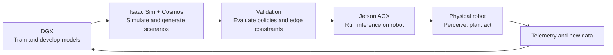
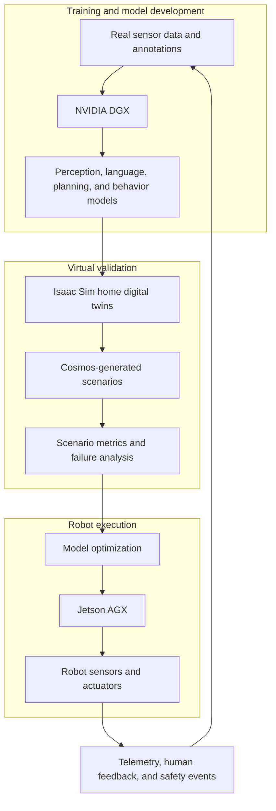
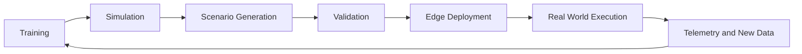

# NVIDIA Physical AI Workshop Delhi: My Journey into the Future of Robotics

> A first-person learning journal about Physical AI, robotics simulation, synthetic data, and the path from large-scale model development to real-world robot execution.

## Introduction

Attending the NVIDIA Physical AI Workshop in Delhi gave me an opportunity to look at artificial intelligence from a different angle. Much of modern AI is experienced through a screen: we ask a chatbot a question, upload an image for classification, or use a recommendation system. Robotics changes the relationship between intelligence and the world. A robot must observe its surroundings, understand what is happening, decide what to do next, and act safely despite incomplete information.

That shift—from producing an answer to producing a reliable physical action—was the central idea I took away from the workshop. Physical AI is becoming increasingly important because intelligence is moving beyond data centers and user interfaces into vehicles, factories, warehouses, hospitals, homes, and public spaces. These systems must operate with uncertainty, latency, limited energy, changing environments, and direct consequences when a decision is wrong.

The workshop helped me connect several ideas that are often studied separately: foundation models, simulation, synthetic data, digital twins, accelerated computing, edge inference, robotics middleware, and safety validation. The most useful mental model was a development loop in which powerful computers train models, simulation environments expose them to many situations, and compact edge computers run the resulting systems on physical robots.

This README documents my learning journey. It is not a product comparison or a claim of independent implementation. Instead, it is an educational synthesis of the concepts that stood out to me and a realistic case study showing how they could fit together.

## What is Physical AI?

**Physical AI is the design of intelligent systems that perceive, reason about, and act in the physical world.** A robot with cameras, depth sensors, microphones, wheels, arms, and onboard compute is not only processing information; it is continuously interacting with reality.

A useful beginner-friendly way to understand the difference is:

| System | Main output | Typical challenge |
|---|---|---|
| Chatbot | Text, code, or another digital response | Understanding language and context |
| Computer vision model | A label, detection, segmentation, or feature | Interpreting visual data |
| Physical AI system | A sequence of physical actions | Acting safely under uncertainty |

A conventional AI application may be evaluated by accuracy, latency, or user satisfaction. A robot must also consider collision risk, stability, localization error, actuator limits, battery life, communication delays, and the behavior of people around it.

A robot therefore needs at least four connected capabilities:

1. **Perception** – Convert sensor data into useful estimates: objects, free space, people, poses, surfaces, sounds, and motion.
2. **Reasoning** – Interpret the situation and connect observations with goals, rules, and learned knowledge.
3. **Planning** – Select a safe sequence of navigation, manipulation, or communication actions.
4. **Action** – Send commands to motors, grippers, speakers, displays, or other actuators and then verify the result.

The loop is continuous rather than linear. A robot plans, acts, observes the consequence, updates its belief about the world, and replans when necessary. This is why robotics is difficult: the environment is not a static dataset. It reacts back.

### Why traditional AI is not enough

A model can recognize a chair in an image without knowing whether a wheelchair can pass beside it. A language model can suggest “bring water” without knowing where the glass is, whether the path is blocked, or whether a person is currently standing in front of the robot. Physical AI combines learned models with geometry, control, state estimation, planning, and system-level safety.

## Key Learnings from the Workshop

### NVIDIA Robotics Vision

The workshop presented robotics as a full-stack engineering problem. Intelligent robots need more than a neural network: they need training infrastructure, simulation tools, data pipelines, optimized libraries, robot software, sensors, actuators, and deployment hardware.

NVIDIA’s robotics strategy can be understood as connecting three development realities:

- **Large-scale computing** for training and model development.
- **High-fidelity simulation** for testing situations that are expensive, rare, or unsafe to reproduce physically.
- **Efficient edge computing** for running models with low latency on a robot.

This is a practical response to the data problem in robotics. Real-world data is valuable, but collecting it can be slow, expensive, and risky. Simulation and synthetic data can expand coverage, while physical testing remains essential for validating assumptions.

The important lesson for me was that robotics progress depends on the workflow around the model as much as the model itself. A perception model that performs well in a benchmark is only one part of a dependable autonomous system.

## NVIDIA’s Three Computer Solution

The three-computer concept describes a division of labor across the robotics development lifecycle. In the workshop framing, the computers are not isolated products; they form a connected pipeline from learning to simulation to deployment.

### 1. NVIDIA DGX

**Purpose:** DGX systems represent the high-performance training side of the workflow. They are designed for demanding AI development workloads, including large model training, fine-tuning, evaluation, and experimentation.

For robotics, a DGX-class environment can support:

- Training perception models for detection, segmentation, depth, and pose estimation.
- Developing multimodal or foundation-model components that connect language, vision, and action.
- Processing large synthetic and real-world datasets.
- Running evaluation jobs across many environments and scenarios.
- Compressing, optimizing, or distilling models for edge deployment.

The beginner-friendly explanation is simple: DGX is where we can afford to use more compute to learn useful representations and policies. The advanced point is that training is only one stage. A model trained on a powerful server must later meet the memory, power, thermal, and latency limits of the target robot.

### 2. NVIDIA Isaac Sim

**Isaac Sim is a robotics simulation environment used to create virtual worlds, place robots and sensors inside them, and test behavior before physical deployment.** A simulation can include a robot model, cameras, lidar, physics, objects, lighting, navigation maps, and task objectives.

Simulation is useful for:

- Building digital twins of rooms, warehouses, laboratories, and production areas.
- Generating labeled sensor data at scale.
- Replaying repeatable experiments.
- Testing navigation and manipulation policies.
- Exploring failures without damaging hardware or injuring people.
- Measuring performance under controlled changes in lighting, object placement, and sensor noise.

A digital twin is not automatically a perfect copy of reality. It is a useful model whose value depends on the assumptions, calibration, physics, and sensor realism behind it. This led to an important engineering insight: simulation should reduce uncertainty, not hide it.

### 3. NVIDIA Cosmos

In the workshop context, **NVIDIA Cosmos** represents tools and models for building, generating, and evaluating world scenarios for Physical AI. World-generation capabilities can help create diverse visual and physical situations that are difficult to collect manually.

For robotics learning, synthetic scenario generation can vary:

- Room layouts and object placement.
- Lighting, weather, and camera conditions.
- Human motion and interaction patterns.
- Obstacle locations and navigation constraints.
- Rare or difficult events that need targeted testing.

The value is not simply producing more images or videos. The goal is to create useful training and evaluation distributions: scenarios that are diverse enough to improve robustness and structured enough to measure behavior. Synthetic data still requires quality checks, domain-randomization choices, and comparison with real sensor data.

### 4. NVIDIA Jetson AGX

**Jetson AGX represents the edge side of the workflow.** It is designed for running AI and robotics workloads close to sensors and actuators, where response time, energy use, connectivity, and physical packaging matter.

On a robot, an edge computer may handle:

- Camera and lidar processing.
- Object and person detection.
- Local mapping and localization.
- Path planning and obstacle avoidance.
- Voice or multimodal interaction.
- Safety monitors and fallback behaviors.
- Communication with motors and robot controllers.

Running inference locally can reduce dependence on a remote server and lower network-induced delay. However, deployment is not a simple copy operation. Models may need quantization, TensorRT optimization, memory profiling, scheduling, and careful integration with robotics software.

### How the components work together

| Stage | Computer or platform | Main responsibility | Key question |
|---|---|---|---|
| Learn | NVIDIA DGX | Train, fine-tune, and evaluate AI models | Can the model learn useful behavior? |
| Imagine and test | Isaac Sim | Simulate robots, sensors, physics, and environments | Does the behavior work across controlled scenarios? |
| Expand scenarios | NVIDIA Cosmos | Generate and vary world situations for learning and evaluation | Have we covered enough diversity and rare cases? |
| Validate | DGX plus simulation stack | Compare metrics, investigate failures, and refine models | Is the system robust enough for the intended conditions? |
| Execute | Jetson AGX | Run optimized models and robotics software at the edge | Can the robot respond within real-time constraints? |
| Observe | Physical robot | Collect telemetry and real-world evidence | What did simulation fail to capture? |

This is better understood as a feedback loop than as a one-way assembly line. Real-world observations should improve the simulation and data strategy, while simulation should reduce unnecessary physical experiments.

## Understanding Robotics Environments

The difficulty of a robotic task is strongly influenced by the environment. A robot that performs reliably in a repeatable factory cell may struggle in a family home because the number of possible configurations and interactions is much larger.

### Structured environments

**Examples:** manufacturing plants and industrial automation cells.

**Characteristics:**

- High precision requirements.
- Low variability in object locations and workflows.
- Known surfaces, tools, and safety boundaries.
- Repeatable lighting and operating procedures.

Structured environments are comparatively friendly to automation. Robots can use fixtures, predefined trajectories, calibrated sensors, and restricted workspaces. This does not make them trivial—precision, timing, safety, and uptime are demanding—but the operational distribution is narrower.

### Semi-structured environments

**Examples:** laboratories and warehouses.

**Characteristics:**

- Moderate variability in objects and layouts.
- Partly controlled access and operating procedures.
- Human workers sharing space with machines.
- More frequent changes than in a fixed production cell.

A warehouse robot may know the map but still encounter a temporary pallet, a person crossing an aisle, or a shelf that has been rearranged. Laboratory robots may work with standardized instruments while facing changes in containers, protocols, and human collaboration.

### Unstructured environments

**Examples:** homes, hospitals, and public spaces.

**Characteristics:**

- High variability in layouts and object placement.
- Dynamic interactions with people and animals.
- Incomplete or changing maps.
- Unpredictable lighting, noise, and accessibility conditions.
- Ambiguous tasks and context-dependent social expectations.

Unstructured environments are among robotics’ biggest challenges because the robot cannot rely on a small set of assumptions. A home may contain narrow passages, reflective surfaces, rugs, low furniture, pets, children, visitors, and objects that move every day. A hospital adds privacy requirements, medical workflows, elevators, alarms, and high consequences for mistakes.

The core challenge is **generalization**: can a robot transfer what it learned in one environment to a new environment without becoming unsafe? This is where simulation diversity, synthetic data, robust perception, uncertainty estimation, human-aware planning, and conservative fallback behavior become important.

## Real-World Problem Statement

### AI-Powered Elderly Assistance Robot

Many elderly people need occasional help with daily activities at home, such as locating an object, carrying a lightweight item, providing reminders, detecting a possible fall, or guiding a person through a familiar routine. The goal is not to replace human care. The goal is to provide reliable assistance while preserving independence and escalating to a caregiver when the robot is uncertain.

A home-assistance robot could be asked to:

- Navigate from a bedroom to the kitchen.
- Bring a bottle of water.
- Remind a user about a scheduled activity.
- Detect that a usual route is blocked.
- Recognize when a person needs human help.
- Return to a charging station safely.

The challenges are substantial:

- Every home has a different layout.
- Furniture may move between visits.
- Lighting changes from morning to night.
- Objects can be left on the floor.
- A person may walk unexpectedly into the robot’s path.
- The user may give incomplete or ambiguous instructions.
- The robot must respect privacy and avoid overconfident decisions.

Traditional hard-coded programming would fail to scale because it would require engineers to enumerate too many possibilities. Rules such as “turn left after the sofa” break when the sofa moves. A fixed obstacle map breaks when a chair is added. A scripted interaction breaks when the user responds differently from the expected sequence.

This does not mean rules are useless. Safety constraints, emergency stops, speed limits, geofences, and action permissions should remain explicit. The more realistic solution combines learned perception and reasoning with deterministic safety and control layers.

## Proposed Solution Using NVIDIA Technologies

The following architecture is a conceptual design for the case study rather than a claim of a completed implementation.

### Step 1: Define tasks and safety boundaries

Before training a model, the team should define what the robot is allowed to do. For example, it may carry lightweight objects but not dispense medication without authorization. It may stop when a person is too close, ask for clarification when a request is ambiguous, and contact a caregiver when a fall is suspected.

These boundaries turn a broad goal—“help an elderly person”—into measurable tasks and failure conditions.

### Step 2: Build models on DGX

DGX-class infrastructure can be used to prepare datasets, train perception models, fine-tune multimodal components, and evaluate candidate policies. The data could combine real home-like recordings, annotated sensor data, and carefully designed synthetic examples.

The training loop should track more than average accuracy. Useful metrics may include navigation success, collision rate, intervention rate, response latency, false alarms, missed hazards, and performance across lighting and layout variations.

### Step 3: Create virtual homes with Isaac Sim

Isaac Sim can provide configurable homes with rooms, doors, furniture, ramps, carpets, tables, and charging stations. Sensors can be modeled with different fields of view and noise characteristics. The robot can then practice navigation, object search, person-following, and delivery tasks in repeatable environments.

Simulation makes it possible to run thousands of variations without asking an elderly participant to repeat a risky scenario. It also allows the team to reproduce a failure exactly and inspect what the robot believed at each time step.

### Step 4: Generate difficult scenarios with Cosmos

Cosmos can help expand scenario coverage. For example, the team could generate variations involving low light, clutter, unusual furniture arrangements, partially occluded objects, or human motion patterns that are uncommon but important.

The generated scenarios should be reviewed and filtered. Synthetic diversity is useful only when it corresponds to plausible conditions and improves performance on held-out real-world tests.

### Step 5: Validate before deployment

Validation should occur in layers:

1. **Offline evaluation:** test models against held-out datasets.
2. **Simulation evaluation:** run repeatable tasks across many environments.
3. **Hardware-in-the-loop testing:** connect software to representative sensors and controllers.
4. **Supervised physical testing:** operate in a controlled space with an emergency stop.
5. **Limited pilot deployment:** start with narrow tasks, human oversight, and clear escalation rules.

This staged approach helps uncover the sim-to-real gap. A robot may appear successful in simulation but fail because a real camera saturates near a window, wheels slip on a rug, or a person behaves differently than the synthetic model assumed.

### Step 6: Optimize for Jetson AGX

After validation, models must be prepared for edge constraints. The deployment process may include reducing precision, compiling optimized inference engines, managing memory, profiling end-to-end latency, and scheduling perception and control workloads.

The robot should remain useful even when connectivity is poor. Local safety functions—such as stopping for an obstacle—should not depend on a round trip to a cloud service.

### Step 7: Execute, monitor, and learn

On the physical robot, Jetson AGX can process sensor streams and coordinate with the navigation and control stack. The system should log relevant telemetry without collecting unnecessary personal data. Human feedback and failure reports can then guide the next training and simulation cycle.

A responsible deployment also needs privacy controls, clear user consent, accessible interaction design, maintenance procedures, and a way for people to override or disable the robot.

## Technical Workflow Diagram

The complete workflow can be summarized as follows:

### A practical engineering interpretation

- **Training:** learn representations and policies from real and synthetic data.
- **Simulation:** test perception, navigation, and manipulation in controlled virtual worlds.
- **Scenario generation:** expose the system to environmental and human variability.
- **Validation:** measure safety, robustness, latency, and task success.
- **Edge deployment:** optimize models for the target hardware and power budget.
- **Real-world execution:** operate under supervision, monitor failures, and collect evidence.

The loop matters because no single dataset or simulation can fully describe the physical world.

## Key Takeaways

1. Physical AI connects intelligence to perception, decision-making, and physical action.
2. Robotics requires a continuous observe–reason–plan–act loop rather than a one-time prediction.
3. The quality of a robot depends on the complete system, not only on its neural network.
4. DGX-class computing supports large-scale model development, dataset processing, and evaluation.
5. Isaac Sim can make experiments repeatable and safer before physical testing.
6. Digital twins are useful models, but they must be calibrated and validated against reality.
7. Synthetic data can expand coverage for rare, expensive, or unsafe scenarios.
8. Cosmos-style world generation is valuable when scenario diversity is paired with quality control.
9. Jetson AGX illustrates why edge inference matters for latency, privacy, and operation under weak connectivity.
10. The three-computer solution is best understood as a feedback loop, not a linear pipeline.
11. Structured environments are easier to automate because their assumptions are narrow and repeatable.
12. Semi-structured environments require robots to handle change while still benefiting from known workflows.
13. Unstructured environments demand stronger generalization, human-aware planning, and uncertainty handling.
14. Simulation cannot eliminate real-world testing; it helps prioritize and de-risk it.
15. Safety rules and learned behavior should work together rather than being treated as alternatives.
16. Sim-to-real transfer is an engineering problem involving sensors, physics, timing, control, and data distribution.
17. Metrics should include failure rate, intervention rate, latency, and safety—not only accuracy.
18. Assistive robots must preserve human autonomy and provide escalation paths when uncertain.
19. Edge deployment requires model optimization, memory profiling, and end-to-end system measurement.
20. The future of robotics will depend on collaboration between AI researchers, roboticists, designers, domain experts, and safety practitioners.

## Future Applications

The same development principles can support many domains, although each requires specialized validation and regulation.

| Domain | Potential application | Main technical challenge |
|---|---|---|
| Healthcare | Hospital logistics, patient assistance, rehabilitation support | Safety, privacy, clinical workflows, human trust |
| Smart cities | Mobility monitoring, public-space assistance, infrastructure inspection | Scale, public interaction, changing outdoor conditions |
| Agriculture | Crop monitoring, targeted treatment, harvesting assistance | Weather, terrain, biological variability |
| Manufacturing | Flexible assembly, inspection, collaborative workcells | Precision, uptime, integration with production systems |
| Disaster response | Search, mapping, supply delivery, hazardous-area inspection | Limited connectivity, damaged infrastructure, uncertainty |
| Logistics | Warehouse picking, inventory movement, last-mile support | Dynamic traffic, throughput, manipulation reliability |
| Assistive technologies | Mobility support, object retrieval, reminders, home monitoring | Personalization, accessibility, dignity, safe failure |

The common pattern is a move from narrowly scripted automation toward systems that can adapt within clearly defined boundaries. That does not mean every task needs a general-purpose humanoid. In many cases, the most effective solution will be a focused robot with well-designed sensors, workflows, and human handoff mechanisms.

## Personal Reflections

What surprised me most was how much of robotics happens before a robot touches the real world. I initially associated intelligent robots primarily with sensors, motors, and control algorithms. The workshop made it clear that data preparation, simulation, evaluation, model optimization, and deployment constraints are equally central.

I was also struck by the importance of time. In a software application, a delayed answer may be inconvenient. In robotics, delay can change the physical situation. A person may step into a path, an object may fall, or a manipulator may continue moving. This made edge computing feel less like a hardware detail and more like part of the robot’s behavior and safety model.

The workshop inspired me to think about robotics as a learning system rather than a collection of isolated components. A model trained on DGX, tested in Isaac Sim, expanded through synthetic scenarios, and optimized for Jetson is part of a larger lifecycle. Each stage answers a different question, and weaknesses in one stage can appear as failures in another.

It also changed how I think about AI progress. Intelligence in the physical world cannot be measured only by how impressive a model’s output looks. A useful robot must be predictable, measurable, maintainable, understandable to its users, and humble about uncertainty.

I believe Physical AI will become increasingly important because many meaningful problems exist outside the screen. Supporting older adults, improving workplace safety, inspecting infrastructure, helping in disasters, and making logistics more efficient all require systems that can understand and act in physical environments. The opportunity is significant, but so is the responsibility to design systems that respect safety, privacy, accessibility, and human decision-making.

## Resources

The following resources are useful starting points for continuing this learning journey:

- [NVIDIA Robotics](https://www.nvidia.com/en-us/industries/robotics/) — overview of NVIDIA’s robotics platform, simulation, models, and development approach.
- [NVIDIA Isaac](https://developer.nvidia.com/isaac) — robotics development platform, Isaac Sim, Isaac ROS, libraries, and reference workflows.
- [NVIDIA Jetson](https://developer.nvidia.com/embedded-computing/) — edge AI and robotics platform documentation and developer resources.
- [Jetson Getting Started](https://developer.nvidia.com/embedded/learn/getting-started-jetson) — practical entry point for Jetson development kits and software.
- [NVIDIA Omniverse](https://www.nvidia.com/en-us/omniverse/) — platform and ecosystem for building and connecting 3D workflows.
- [NVIDIA Cosmos](https://www.nvidia.com/en-us/ai/cosmos/) — resources related to world foundation models and Physical AI development.
- [NVIDIA Isaac ROS](https://developer.nvidia.com/isaac-ros) — ROS 2-oriented software and accelerated robotics workflows.

When using these resources, I would recommend starting with the fundamentals of robotics perception, coordinate frames, probability, control, ROS 2, and simulation. Platform tools become much easier to understand when the underlying robotics concepts are clear.

## Conclusion

The NVIDIA Physical AI Workshop in Delhi helped me understand why the next generation of autonomous systems will depend on more than larger models. Robots need a complete path from data and training to simulation, validation, optimized edge inference, and responsible operation in the real world.

The three-computer solution provides a useful way to remember that path: DGX helps develop intelligence, Isaac Sim and Cosmos help create and test worlds, and Jetson AGX helps bring optimized intelligence to the robot. The workflow is strengthened by feedback from physical deployment, because reality always reveals assumptions that simulation missed.

Simulation, synthetic data, and edge AI are therefore not separate trends. Together, they form an engineering foundation for building robots that can learn more efficiently, test more safely, and respond more reliably. My main takeaway is that Physical AI is not simply about putting a model inside a machine. It is about designing a dependable relationship between intelligence, embodiment, environment, and people.

That is the direction I want to continue exploring: robotics systems that are technically capable, carefully evaluated, and genuinely useful to the humans they are built to serve.

---

## Acknowledgment

I am grateful to the organizers and speakers of the NVIDIA Physical AI Workshop in Delhi for creating a learning environment that connected advanced AI infrastructure with practical robotics challenges. I also acknowledge the work of **NVIDIA**, **NVIDIA Robotics**, and **Kavita Aroor** for contributing to the ideas and discussions that shaped my understanding of Physical AI.

> This repository is an independent educational reflection based on workshop learning. It is not an official NVIDIA publication and does not represent product commitments, performance guarantees, or deployment advice for safety-critical systems.
